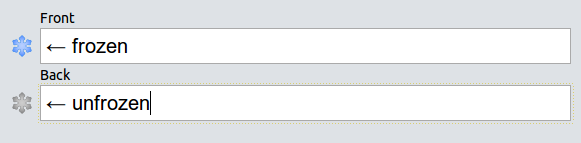

## Frozen Fields Add-on for Anki

*Frozen Fields* is an add-on for the spaced-repetition flashcard app [Anki](https://apps.ankiweb.net/) that allows you to conveniently sticky and unsticky a field right from within the note editor.

### Table of Contents

<!-- MarkdownTOC -->

- [Screenshots](#screenshots)
- [Installation](#installation)
- [Documentation](#documentation)
- [License and Credits](#license-and-credits)

<!-- /MarkdownTOC -->

### Screenshots

### Installation

**AnkiWeb**

[Link to the add-on on AnkiWeb](https://ankiweb.net/shared/info/not_available_yet)

**Manual installation**

*Anki 2.0*

1. Go to *Tools* -> *Add-ons* -> *Open add-ons folder*
2. Find and delete `Frozen Fields.py` and `frozen_fields` if they already exist
3. Download and extract the latest Anki 2.0 add-on release from the [releases tab](https://github.com/Glutanimate/frozen-fields/releases)
4. Move `Frozen Fields.py` and `frozen_fields` into the add-ons folder
5. Restart Anki

*Anki 2.1*

1. Go to *Tools* -> *Add-ons* -> *Open add-ons folder*
2. See if the `frozen_fields` folder already exists
3. If you would like to keep your settings thus far: Find the `meta.json` file contained within and copy it to a safe location.
4. Proceed to delete  the `frozen_fields` folder
3. Download and extract the latest Anki 2.1 add-on release from the [releases tab](https://github.com/Glutanimate/frozen-fields/releases)
4. Move the new `frozen_fields` folder into the add-ons directory
5. Optional: Place the `meta.json` file back in the directory if you created a copy beforehand.
5. Restart Anki

### Documentation

For further information on the use of this add-on please check out [the original add-on description](docs/description.md).

### License and Credits

*Copyright © 2012-2015 [Tiago Barroso](https://github.com/tmbb)*

*Copyright © 2015-2018 [Aristotelis P.](https://glutanimate.com/)*

*Frozen Fields* is the brainchild of Tiago Barroso. All credit for coming up with this fantastic add-on goes to him.

The present fork and update to Anki 2.1 was made possible through the kind support of a fellow Anki user who would like to remain anonymous.

This program is free software: you can redistribute it and/or modify it under the terms of the [GNU Affero General Public License](https://www.gnu.org/licenses/agpl.html) as published by the Free Software Foundation, either version 3 of the License, or (at your option) any later version. 

This program is distributed in the hope that it will be useful, but WITHOUT ANY WARRANTY; without even the implied warranty of MERCHANTABILITY or FITNESS FOR A PARTICULAR PURPOSE. See the GNU General Public License for more details.